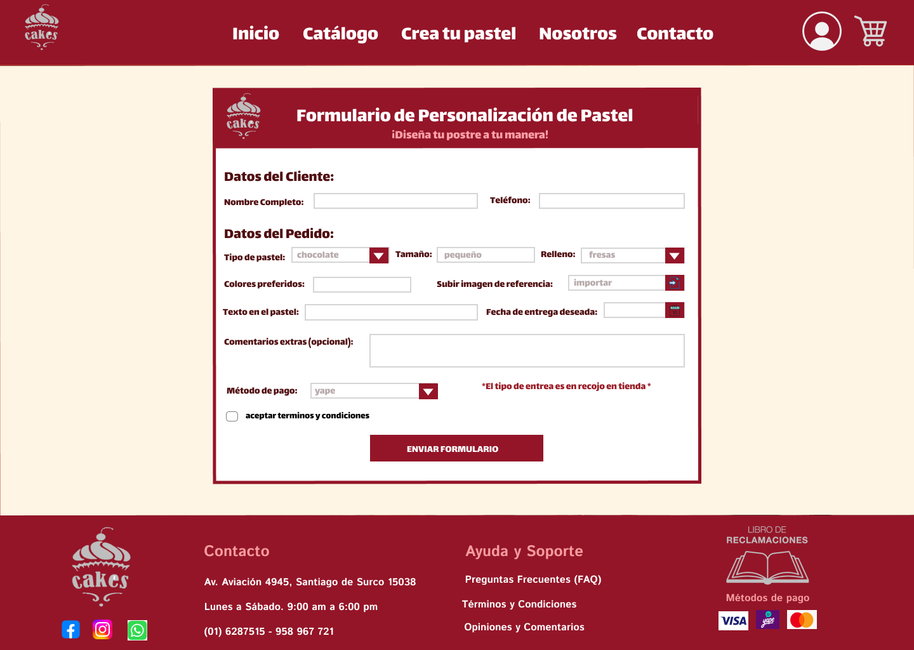

#Sistema de pedidos en linea para la pasteleria Aurora
# 🛒 Aplicativo Web Para la Pasteleria Aurora – Proyecto De Herramientas de Desarrollo
---
## 📘 Descripción del Proyecto
La pastelería Aurora presenta dificultades en la gestión integral de sus operaciones debido al uso de procesos manuales poco eficientes. Actualmente, la toma de pedidos, el control del inventario y la atención al cliente se realizan sin un sistema centralizado, lo que genera errores frecuentes en los pedidos, retrasos en las entregas y desconocimiento sobre la disponibilidad real de productos.

Asimismo, los clientes carecen de una plataforma digital que les permita visualizar el catálogo, personalizar productos según sus preferencias o recibir notificaciones sobre el estado de sus pedidos. Esta carencia tecnológica reduce la experiencia del cliente, limita el alcance del negocio a nivel competitivo y sobrecarga al personal con tareas operativas repetitivas.

En consecuencia, la falta de automatización frena el crecimiento sostenible de la empresa, disminuye la satisfacción del cliente y afecta la capacidad de la pastelería para adaptarse a las nuevas demandas del mercado.

## Tecnologias usadas
- **Java 17** → Lenguaje principal para la lógica de negocio del sistema.  
- **Spring Boot** → Framework para el desarrollo del backend, simplifica la configuración y ejecución de la aplicación.  
- **Maven** → Herramienta de gestión y construcción de dependencias.  
- **MySQL** → Sistema de gestión de base de datos relacional para almacenar la información de productos, usuarios y pedidos.  
- **Thymeleaf** → Motor de plantillas utilizado para generar las vistas dinámicas en el frontend.  
- **HTML5, CSS3 y JavaScript** → Tecnologías base para la interfaz gráfica y diseño responsivo.  
- **Git & GitHub** → Sistema de control de versiones y repositorio remoto para trabajo colaborativo.  
- **Visual Studio Code / IntelliJ IDEA** → Entornos de desarrollo integrados utilizados por el equipo.  

## Instalación y Ejecución

1. Instalar Java Development Kit (JDK 17 o superior). <https://www.oracle.com/java/technologies/downloads/>

y luego verificar en el cmd con:
```bash
java -version
```

2. Instalar Maven. <https://maven.apache.org/download.cgi>

y luego verificar en el cmd con:
```bash
mvn -v
```

3. Instalar un IDE compatible. <https://code.visualstudio.com/download>
4. Ingresar a Spring Initializr y crear un proyecto <https://start.spring.io/>
5. Descargar y abrir el proyecto en el IDE.
6. Configurar el archivo application.properties con la conexión a la base de datos MySQL
```bash
//BD
spring.datasource.url=jdbc:mysql://localhost:3306/pasteleria
spring.datasource.username=Pasteleria
spring.datasource.password=pasteleriagera

//JPA
spring.jpa.hibernate.ddl-auto=update
spring.jpa.properties.hibernate.dialect=org.hibernate.dialect.MySQL8Dialect
spring.jpa.show-sql=true
```
7. Crear las entidades, repositorios, servicios y controladores necesarios.
8. Diseñar las páginas HTML en la carpeta src/main/resources/templates (usando Thymeleaf).
9. Ejecutar el proyecto con:
```bash
mvn spring-boot:run
```
10.Abrir el navegador en <http://localhost:8080> para ver la aplicación funcionando.


## Roles y Crédito

| Nombre   | Rol                          | Funciones                                                                 |
|----------|------------------------------|----------------------------------------------------------------------------|
| Gerardo  | **Líder y Desarrollador Backend**       | Coordinar al equipo, definir tareas, integrar módulos, supervisar avances y velar por la seguridad de la aplicación |
| Ana      | **Desarrolladora Frontend**  | Diseñar interfaces en HTML, estructurar formularios y vistas del sistema, asegurar la usabilidad y experiencia del usuario |
| Alexander| **Responsable de Versiones** | Configurar Git/GitHub, gestionar ramas, merge y resolver conflictos, mantener la integridad del repositorio |
| Josue    | **Desarrollador Backend**    | Implementar lógica con Spring Boot, crear controladores y servicios, garantizar la eficiencia y escalabilidad del sistema |
| Jennifer | **Encargada de la Base de Datos** | Crear y gestionar la base en MySQL, modelar tablas y relaciones, seguridad de datos con encriptación y respaldo de la información |


## Flujo de Trabajo en Git

### GitHub Flow

GitHub Flow es una metodología de trabajo colaborativo simple y eficiente que se basa en el uso de ramas (branches) para el desarrollo de funcionalidades. Este flujo permite que múltiples desarrolladores trabajen simultáneamente en diferentes características del proyecto sin interferir entre sí, manteniendo la rama principal (main) siempre estable y desplegable. La filosofía central es crear una rama para cada nueva funcionalidad, desarrollar en ella, y una vez completada, integrarla a la rama principal mediante Pull Requests que permiten la revisión de código por parte del equipo.

### 1. Primera vez (solo el creador del repositorio)
```bash
# 1. Crear el repositorio local
git init

# 2. Conectar con el repositorio remoto (GitHub)
git remote add origin <url_del_repositorio>

# 3. Preparar el proyecto inicial
git add .

# 4. Confirmar el proyecto base
git commit -m "proyecto base"

# 5. Cambiar el nombre de la rama principal a 'main'
git branch -M main

# 6. Subir al repositorio remoto
git push -u origin main
```
### 2. Primera vez (cada integrante, incluido el creador)
```bash
# 1. Clonar el repositorio remoto a tu PC
git clone <url_del_repositorio>

# 2. Entrar a la carpeta del proyecto
cd <nombre_proyecto>

# 3. Crear y cambiar a tu rama personal
git checkout -b <mi_rama>

# 4. Subir tu rama al repositorio remoto
git push -u origin <mi_rama>
```
### 3. Flujo diario (cada integrante)
```bash
# 1. Cambiar a tu rama de trabajo
git checkout <mi_rama>

# 2. Actualizar tu rama con lo último de 'main'
git pull origin main

# 3. Realizar cambios en el proyecto (código, HTML, templates, etc.)
# Después de trabajar, preparar los cambios:
git add .

# 4. Confirmar los cambios con un mensaje descriptivo
git commit -m "descripción clara de los cambios realizados"

# 5. Subir tu trabajo a tu rama remota
git push origin <mi_rama>
```
### 4. Unir cambios a main (cuando terminas una funcionalidad)
* Recomendado: Crear un Pull Request (PR) desde GitHub para que el equipo pueda revisar los cambios antes de integrarlos a la rama principal.
* En el PR, describir claramente qué funcionalidad se implementó y qué cambios se realizaron.
* Esperar la aprobación de al menos un compañero antes de hacer el merge.
### 5. Después de un Pull Request (PR) aceptado
```bash
# 1. Cambiar a tu rama de trabajo
git checkout <mi_rama>

# 2. Actualizar tu rama local con los últimos cambios de main
git pull origin main

# 3. (Opcional) Eliminar la rama si la funcionalidad está completamente terminada
git branch -d <nombre_rama_completada>
git push origin --delete <nombre_rama_completada>
```
### 6. Comandos útiles adicionales
```bash
# Ver todas las ramas locales y remotas
git branch -a

# Ver el estado actual de los archivos
git status

# Ver el historial de commits
git log --oneline

# Descartar cambios no confirmados en un archivo
git checkout -- <nombre_archivo>
```
## Capturas de Pantalla

### **USUARIO**

#### **Inicio**


#### **Lista de Productos**


#### **Carrito de Compras**


#### **Pedidos personalizado**


#### **Nosotros**


#### **Iniciar sesion y Crear Cuenta**


### **ADMINISTRADOR**

#### **Gestionar productos**


#### **Lista de usuarios**


#### **Los pedidos**

